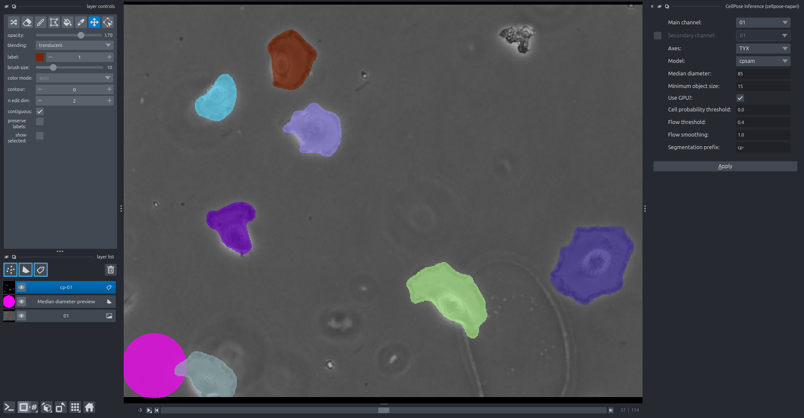

.. cellpose-napari documentation master file, created by
   sphinx-quickstart on Thu Oct  1 00:43:18 2015.
   You can adapt this file completely to your liking, but it should at least
   contain the root `toctree` directive.

Cellpose-Napari
===============

:code:`cellpose-napari` is a package containing a Napari plugin enabling the usage of Cellpose from Napari.

This plugin works for both Cellpose 3 and Cellpose 4 (Cellpose SAM) and is compatible with Napari 0.5 and later.

The term "usage" includes:

* Inference on images in the Napari viewer (2D, 2D+t, 2D composites, 2D+t composites, 3D, 3D+t, 3D composites and 3D+t composites).
* Batch inference over a folder full of images.
* Train a Cellpose model using custom data.
* Possibly use your custom models.

Please see Cellpose `documentation`_ for more information on the algorithm and the settings.

If you use this plugin please cite 
::
    
      @article{stringer2021cellpose,
      title={Cellpose: a generalist algorithm for cellular segmentation},
      author={Stringer, Carsen and Wang, Tim and Michaelos, Michalis and Pachitariu, Marius},
      journal={Nature Methods},
      volume={18},
      number={1},
      pages={100--106},
      year={2021},
      publisher={Nature Publishing Group}
      }

.. _documentation: http://www.readthedocs.cellpose.io

.. toctree::
   :maxdepth: 3
   :caption: Basics:
   
   installation
   inference
   settings
